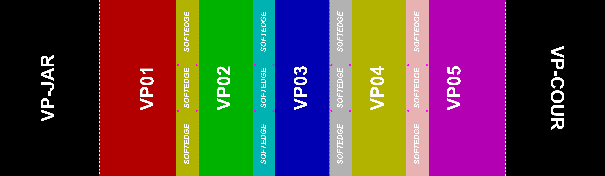
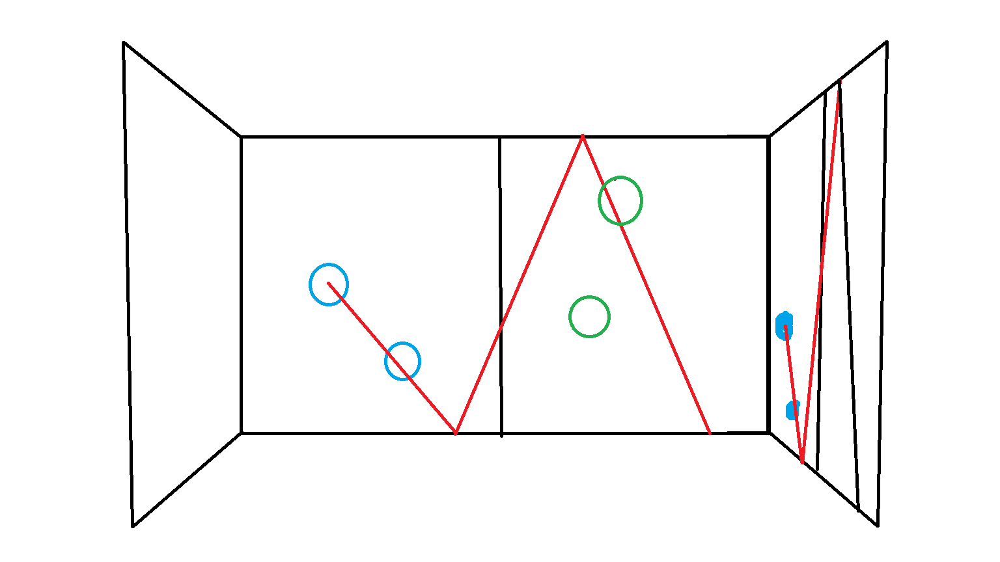

# Projection Area
^projection-map

# Fireball Combat

- players: 8 (4 on each side of the [[#Projection Area]] to play 2 sessions at the same time)
- genre: combat

- desc: 
	4 players split into 2 teams.

	each player has one role between combat or support.

	combatants stand next to the wall to shoot fireballs and block to reduce the enemy's HP to 0. once energy runs out the combatant can neither attack nor block

	supporters run on the floor to collect energy that will be sent to the combatants, allowing them to keep fighting.

- status: refused
	running 2 sessions at the same time would consume too many CPU resources but running 1 session at a time would leave the other side of the projection area unused

# Laser Tag thing

proposed by Mehdi

- players: 4
- genre: real time shooter(?)

walls are Heads Up Display

bullet fires after a timer reaches 0 
	timer can start by one of two methods:
		1. button on wall
		2. coming close with a team mate

energy is collected by collecting shapes  on the ground

100% energy special bullet:
	rebounds even from the back of the play area to the other wall. goes into walls and rebounds back `FriendlyFire = ON` hitting self or a teammate loses a point
	 - if the bullet hits two players at the same time the team that fired it gets 100% energy
	 - if the energy shape is far enough from the player then the player gets a reward for collecting it (how to measure the distance of the player from the energy shape?)

bullet fires in the direction of the second player in the team, bullet rebounds based on energy (more energy = more bounces) enemy can move and avoid the bullet in real time while collecting energy

each team has a certain (number of bullets, time) in possession and the game ends when the (bullets, time) run out and one team has more points

in case of a draw the number of bullets becomes infinite until one team gains a point (golden goal)